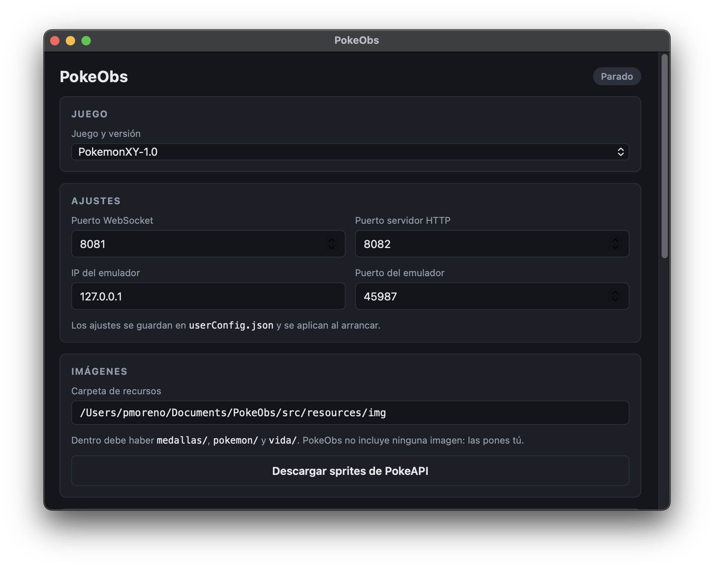
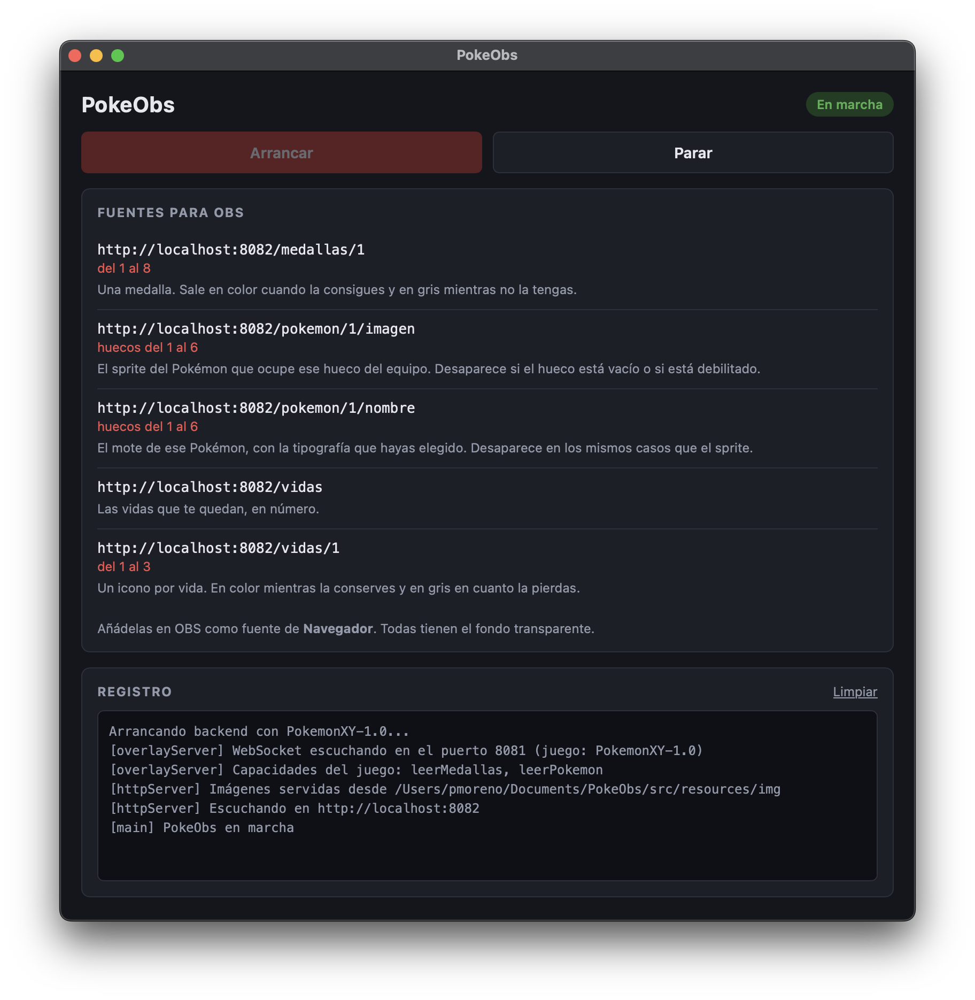

# PokeObs


[](https://github.com/Pmoreno447/PokeObs/releases/latest)
[](https://github.com/Pmoreno447/PokeObs/actions/workflows/release.yml)

> Overlays para OBS con los datos de tu partida de Pokémon en tiempo real

PokeObs lee la memoria del emulador mientras juegas y muestra en tu directo las
medallas, el equipo y las vidas de un Nuzlocke como fuentes de navegador de OBS,
con fondo transparente. Se configura desde una aplicación de escritorio y no
necesita instalar nada más.

---

## ¿Qué hace?

Abres PokeObs, eliges tu juego, pulsas **Arrancar** y la aplicación te da las
direcciones que tienes que añadir en OBS. A partir de ahí, los overlays se
actualizan solos mientras juegas.

<p align="center">
  
  
</p>

| Overlay | Qué muestra |
|---|---|
| **Medallas** | Una fuente por medalla: en color cuando la consigues y en gris mientras no la tengas. |
| **Equipo** | La imagen y el mote de cada Pokémon del equipo, en su orden real. Se ocultan los huecos vacíos y los Pokémon debilitados. |
| **Vidas** | Contador para retos Nuzlocke, en número o como un icono por vida. Resta una vida cada vez que cae un Pokémon y conserva la cuenta entre sesiones. |

Todo es personalizable: usas tus propias imágenes, y la tipografía y el color del
texto se configuran desde la aplicación. Para las miniaturas de los Pokémon puedes
descargar los sprites de [PokeAPI](https://pokeapi.co) con un botón.

---

## Juegos soportados

| Juego | Versiones | Emulador |
|---|---|---|
| Pokémon X / Y | 1.0 · 1.1 | [Azahar](https://azahar-emu.org) (3DS) |

El resto de juegos de 3DS, NDS, GBA y Switch están planificados en el
[roadmap](docs/ROADMAP.md). Consulta también las
[limitaciones conocidas](docs/ROADMAP.md#limitaciones-conocidas).

---

## Instalación

### Opción A — Descargar la aplicación (recomendado)

Descarga el paquete de tu sistema desde la última
[Release](https://github.com/Pmoreno447/PokeObs/releases/latest):

| Sistema | Fichero |
|---|---|
| macOS (Apple Silicon) | `PokeObs-macos-arm64.zip` |
| Windows (64 bits) | `PokeObs-windows-x64.zip` |
| Linux (64 bits) | `PokeObs-linux-x64.tar.gz` |

La aplicación no está firmada, así que tu sistema te avisará la primera vez que la
abras. En el [manual de usuario](docs/USER_MANUAL.md#instalación) tienes cómo
continuar en cada sistema.

### Opción B — Desde el código fuente

Requiere **Node.js 24**.

```bash
git clone https://github.com/Pmoreno447/PokeObs
cd PokeObs
npm install
npm run gui:binarios   # descarga los binarios de Neutralino
npm run build
npm run gui
```

Para generar el paquete distribuible de tu sistema en `release/`:

```bash
npm run empaquetar
```

---

## Stack técnico

| Capa | Tecnología |
|---|---|
| Backend | Node.js 24 + TypeScript |
| Servidores de overlays | [Express](https://expressjs.com/) (HTTP) + [ws](https://github.com/websockets/ws) (WebSocket) |
| Aplicación de escritorio | [Neutralinojs](https://neutralino.js.org/) |
| Conexión con el emulador | UDP contra el servidor RPC de Azahar |
| Empaquetado | Node SEA + esbuild + postject: el backend es un único ejecutable |
| CI y publicación | GitHub Actions: compila macOS, Windows y Linux y publica cada Release |

---

## Documentación

| Fichero | Contenido |
|---|---|
| [docs/USER_MANUAL.md](docs/USER_MANUAL.md) | **Manual de usuario**: instalación, cada opción de configuración, uso en OBS y solución de problemas |
| [docs/ARCHITECTURE.md](docs/ARCHITECTURE.md) | **Arquitectura**: estructura del código, módulos y [cómo añadir un juego nuevo](docs/ARCHITECTURE.md#añadir-un-juego-nuevo) |
| [docs/ROADMAP.md](docs/ROADMAP.md) | Diagrama de componentes, fases del proyecto, juegos planificados y limitaciones conocidas |

---

## Aviso legal

Pokémon y los nombres relacionados son marcas de Nintendo, Game Freak y The
Pokémon Company. PokeObs es un proyecto independiente, sin relación con ellas, y
no distribuye ningún recurso de los juegos.
