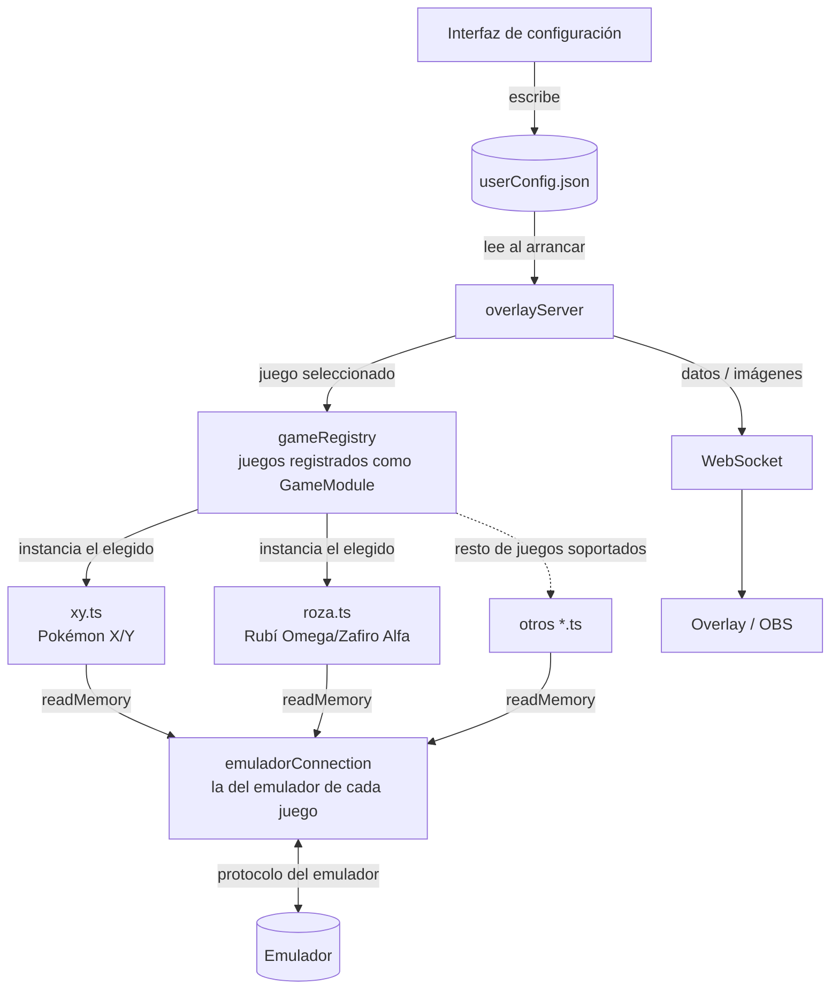

# Roadmap

## Diagrama de componentes

**GameModule.** Cada juego soportado se registra en `gameRegistry.ts` como una
fábrica que devuelve un `GameModule`: un contrato con métodos opcionales
(`leerMedallas`, `leerPokemon`...). El selector solo construye el del juego
elegido, y `obtenerCapacidades()` dice qué implementa, de forma que el servidor
arranca únicamente las lecturas y los overlays que ese juego sabe servir. Todo lo
que hay por encima del contrato (endpoints, overlays, contador de vidas, GUI) es
común a todos los juegos.

**emuladorConnection.** Cada emulador habla su propio protocolo, así que cada
uno tiene su módulo de conexión y cada juego importa el de su plataforma. Hoy
existe `azaharConnection.ts` (UDP contra el RPC de Azahar, para 3DS). El socket se
abre en la primera lectura y no al importar, para que registrar juegos de varias
plataformas no abra conexiones con emuladores que no se están usando. La
configuración tiene un único hueco `emulador` (IP y puerto) que usa la conexión
activa, sea cual sea.

## Fase 1 — Overlay completo para Pokémon X/Y ✅

[Milestone en GitHub](https://github.com/Pmoreno447/PokeObs/milestone/1)

Primera versión usable de principio a fin con un juego concreto.

- **GUI de configuración** (Neutralino). Selector de juego y versión, IP y
  puerto del emulador, puertos de los servidores, vidas, tipografía y carpeta de
  imágenes. Arranca y para el backend, y mientras está en marcha muestra las URLs
  que hay que añadir en OBS.
- **Selección de juego** a través del registro de `GameModule`. El juego se pasa
  como argumento al arrancar y no se guarda en la configuración.
- **Medallas**: un recurso por medalla, en color si se tiene y en gris si no.
- **Equipo Pokémon**: imagen de la especie y mote de cada hueco, en el orden real
  del equipo. Un hueco vacío o un Pokémon debilitado se ocultan.
- **Contador de vidas** para Nuzlocke. Resta una vida cuando los PS de un Pokémon
  pasan a 0, identificándolo por su PID para que reordenar el equipo no cuente
  como muerte. La cuenta se guarda en cada muerte y sobrevive a cerrar la
  aplicación. Se ofrece como número y como un icono por vida.
- **Personalización**. PokeObs no distribuye ninguna imagen: el usuario elige una
  carpeta con `medallas/`, `pokemon/` y `vida/`, y puede poblar `pokemon/` desde
  la GUI con los iconos de PokeAPI. Fuente, color, negrita y cursiva configurables
  por separado para el nombre de los Pokémon y para las vidas.

### Limitaciones conocidas

- **Los PS se actualizan al salir del combate.** El juego trabaja con una copia
  de combate y vuelca los PS al equipo cuando termina, así que la cuenta de vidas
  se actualiza en ese momento. Un Pokémon que caiga y se reviva dentro del mismo
  combate no se contará. Se descartó leer la copia de combate por la complejidad
  que añade.
- **La tabla del equipo solo está verificada en X/Y 1.0.** Se localizó midiendo
  memoria sobre esa versión; en 1.1 se asume la misma dirección.
- **Si se cierra el emulador con el servidor en marcha, los overlays se quedan
  con el último dato** en lugar de vaciarse, porque las lecturas sin respuesta no
  tienen tiempo de espera.

## Fase 2 — Soporte completo para 3DS

[Milestone en GitHub](https://github.com/Pmoreno447/PokeObs/milestone/5)

No requiere conexión nueva: reutiliza `azaharConnection.ts`.

- [#14](https://github.com/Pmoreno447/PokeObs/issues/14) **Rubí Omega / Zafiro
  Alfa.** Mismo motor que X/Y, así que es probable reutilizar las funciones de
  `xy.ts` y limitarse a localizar las direcciones de medallas y equipo.
- [#15](https://github.com/Pmoreno447/PokeObs/issues/15) **Sol / Luna / Ultrasol
  / Ultraluna.** Tienen pruebas en lugar de gimnasios; se pueden exponer por la
  misma interfaz de medallas enviando un número del 1 al 4.

## Fase 3 — Soporte para NDS

[Milestone en GitHub](https://github.com/Pmoreno447/PokeObs/milestone/4)

- [#16](https://github.com/Pmoreno447/PokeObs/issues/16) **Conexión con el
  emulador de NDS**, en su propia carpeta dentro de `emulators/`.
- [#17](https://github.com/Pmoreno447/PokeObs/issues/17) Perla / Diamante / Platino
- [#18](https://github.com/Pmoreno447/PokeObs/issues/18) Oro HeartGold / Plata SoulSilver
- [#19](https://github.com/Pmoreno447/PokeObs/issues/19) Blanco / Negro / Blanco 2 / Negro 2

## Fase 4 — Soporte completo para GBA

[Milestone en GitHub](https://github.com/Pmoreno447/PokeObs/milestone/6)

- [#20](https://github.com/Pmoreno447/PokeObs/issues/20) **Conexión con el
  emulador de GBA**, en su propia carpeta dentro de `emulators/`.
- [#21](https://github.com/Pmoreno447/PokeObs/issues/21) Rojo Fuego / Verde Hoja
- [#22](https://github.com/Pmoreno447/PokeObs/issues/22) Rubí / Zafiro / Esmeralda

## Fase 5 — Soporte completo para Switch

[Milestone en GitHub](https://github.com/Pmoreno447/PokeObs/milestone/7)

- [#23](https://github.com/Pmoreno447/PokeObs/issues/23) **Conexión con el
  emulador de Switch**, en su propia carpeta dentro de `emulators/`.
- [#24](https://github.com/Pmoreno447/PokeObs/issues/24) Espada / Escudo
- [#25](https://github.com/Pmoreno447/PokeObs/issues/25) Escarlata / Púrpura
- [#26](https://github.com/Pmoreno447/PokeObs/issues/26) Diamante Brillante / Perla Reluciente

Cada juego nuevo sigue el mismo patrón: registrarse como `GameModule`, descifrar
los datos de los Pokémon si hace falta, y devolver el número de medallas y la
especie, mote y PS de cada miembro del equipo. Con eso, todos los endpoints y
overlays funcionan sin más cambios.
