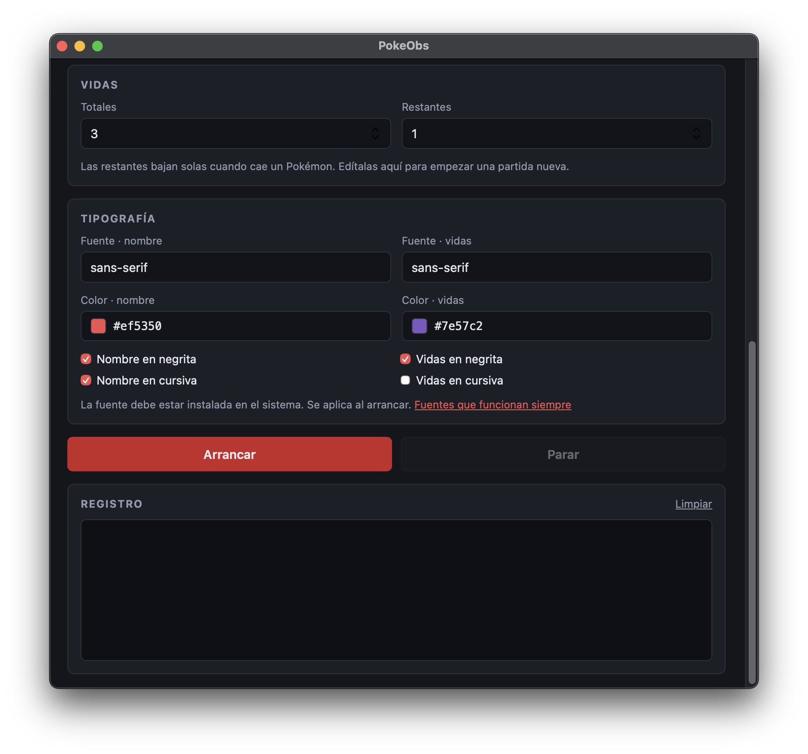
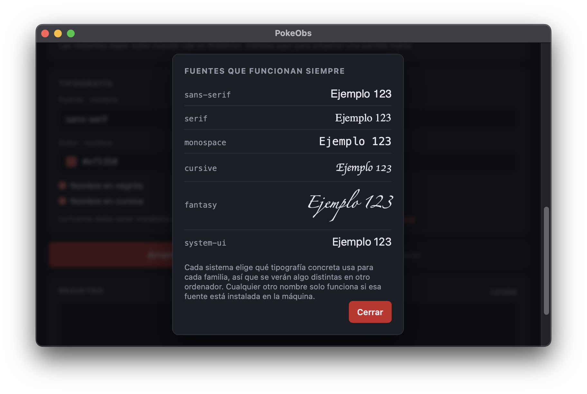

# Manual de usuario

PokeObs muestra en tu directo de OBS los datos de tu partida de Pokémon en tiempo
real: medallas, equipo y vidas de un Nuzlocke. Este manual explica cada opción de
la aplicación y cómo llevar esos datos a OBS.

- [Manual de usuario](#manual-de-usuario)
  - [Puesta en marcha rápida](#puesta-en-marcha-rápida)
  - [Configuración](#configuración)
    - [Juego](#juego)
    - [Ajustes de conexión](#ajustes-de-conexión)
    - [Imágenes](#imágenes)
      - [Descargar sprites de PokeAPI](#descargar-sprites-de-pokeapi)
    - [Vidas](#vidas)
    - [Tipografía](#tipografía)
      - [Fuentes que funcionan siempre](#fuentes-que-funcionan-siempre)
      - [Usar tu propia fuente](#usar-tu-propia-fuente)
  - [Arrancar y usar en OBS](#arrancar-y-usar-en-obs)
    - [Fuentes disponibles](#fuentes-disponibles)
    - [Añadir una fuente en OBS](#añadir-una-fuente-en-obs)
    - [Registro](#registro)
  - [Solución de problemas](#solución-de-problemas)

---

## Puesta en marcha rápida

1. Abre el emulador (**Azahar**) y carga tu partida.
2. En PokeObs, elige tu **juego y versión**.
3. Elige una **carpeta de recursos** y pulsa **Descargar sprites de PokeAPI**.
4. Copia tus imágenes de medallas y de vida dentro de esa carpeta (ver [Imágenes](#imágenes)).
5. Pulsa **Arrancar**.
6. Añade en OBS las direcciones que aparecen, como fuentes de **Navegador**.

---

## Configuración

Todos los ajustes se guardan automáticamente al pulsar **Arrancar** y se
conservan para la próxima vez. Mientras PokeObs está en marcha no se pueden
modificar: pulsa **Parar**, cambia lo que necesites y vuelve a arrancar.

<p align="center">
  
</p>

### Juego

| Opción | Qué es |
|---|---|
| **Juego y versión** | El juego que estás jugando en el emulador. |

> [!IMPORTANT]
> **La versión tiene que coincidir con la de tu juego.** Cada versión guarda los
> datos en posiciones de memoria distintas. Normalmente es la **1.1** si tienes
> instalada la actualización del juego y la **1.0** si no. Si eliges la
> equivocada, las medallas o el equipo aparecerán vacíos o con datos sin sentido:
> prueba con la otra.

### Ajustes de conexión

PokeObs usa tres **puertos**: son "puertas" numeradas por las que se comunican
los programas dentro de tu ordenador. Casi nunca hace falta cambiarlos.

| Opción | Por defecto | Qué es |
|---|---|---|
| **Puerto WebSocket** | `8081` | Canal por el que PokeObs envía los datos en directo a los overlays de OBS. |
| **Puerto servidor HTTP** | `8082` | Puerto de las direcciones que añades en OBS (`http://localhost:8082/...`). |
| **IP del emulador** | `127.0.0.1` | Ordenador donde se está ejecutando el emulador. |
| **Puerto del emulador** | `45987` | Puerto por el que el emulador acepta que se lea su memoria. |

> [!TIP]
> **Cada puerto debe estar libre y ser distinto de los demás.** Si otro programa
> ya usa uno de estos números, PokeObs no podrá arrancar y el registro mostrará
> un error con el texto `EADDRINUSE` o `address already in use`. Cambia ese
> puerto por otro, por ejemplo `8090`.
>
> - Usa números **por encima de 1024**: los inferiores suelen estar reservados al
>   sistema.
> - Evita puertos que ya use tu configuración de streaming. Por ejemplo, el
>   WebSocket integrado de OBS usa el `4455`.

> [!NOTE]
> **IP del emulador.** `127.0.0.1` significa "este mismo ordenador". Déjala así si
> el emulador está en el mismo equipo que PokeObs, que es lo habitual. Solo
> cámbiala si el emulador corre en **otro ordenador de tu red**; en ese caso pon
> la IP local de ese equipo (del estilo `192.168.1.25`) y asegúrate de que su
> cortafuegos permite la conexión.

> [!NOTE]
> **Puerto del emulador.** `45987` es el que usa Azahar. Solo tienes que cambiarlo
> si has cambiado ese puerto en el propio emulador.

> [!WARNING]
> **Si cambias el puerto HTTP, cambian todas las direcciones de OBS.** Tendrás que
> actualizarlas en cada fuente de navegador.

### Imágenes

PokeObs **no incluye ninguna imagen**: tú decides qué se muestra. Pulsa la barra
de **Carpeta de recursos** y elige una carpeta de tu ordenador.

Dentro de esa carpeta PokeObs espera exactamente esta estructura:

```text
tu-carpeta/
├── medallas/
│   ├── 1.png
│   ├── 2.png
│   └── ... hasta 8.png
├── pokemon/
│   ├── 1.png
│   ├── 2.png
│   └── ... un fichero por Pokémon
└── vida/
    └── vida.png
```

| Carpeta | Cómo se nombran los ficheros |
|---|---|
| `medallas/` | Por orden de medalla: `1.png` es la primera que se consigue, `8.png` la última. |
| `pokemon/` | Por **número de Pokédex nacional**: `25.png` es Pikachu, `658.png` es Greninja. |
| `vida/` | Un único fichero, `vida.png`, que se usa para todos los iconos de vida. |

> [!TIP]
> - Usa imágenes **PNG con fondo transparente** para que se integren con tu escena.
> - Escribe los nombres **en minúsculas y con extensión `.png`**. No valen `.jpg`
>   ni `.PNG`.
> - **Cuidado con las extensiones ocultas.** Windows y macOS pueden ocultar la
>   extensión, y un fichero que ves como `1.png` puede llamarse en realidad
>   `1.png.png`. Activa "mostrar extensiones" en tu explorador de archivos para
>   comprobarlo.
> - Guarda la carpeta en un sitio estable, como **Documentos**, y no dentro de la
>   carpeta del programa.

#### Descargar sprites de PokeAPI

La carpeta `pokemon/` es la más costosa de rellenar a mano, porque necesita una
imagen por cada Pokémon. El botón **Descargar sprites de PokeAPI** la crea y la
llena automáticamente con las **miniaturas pixeladas** que se ven en el menú del
equipo de los juegos.

- Necesita **conexión a internet** y tarda alrededor de medio minuto.
- Descarga los **898 Pokémon** hasta la octava generación.
- **No sobrescribe** las imágenes que ya existan: si has personalizado algún
  Pokémon, se respeta y solo se descarga lo que falte. Puedes pulsarlo de nuevo
  sin miedo.
- Primero debes elegir la carpeta de recursos.

Las carpetas `medallas/` y `vida/` tienes que rellenarlas tú.

### Vidas

Para retos Nuzlocke: cada vez que un Pokémon se debilita, pierdes una vida.

<p align="center">
  
</p>

| Opción | Qué es |
|---|---|
| **Totales** | Número total de vidas del reto (de 1 a 99). Determina cuántos iconos de vida hay disponibles. |
| **Restantes** | Vidas que te quedan. Bajan solas cuando cae un Pokémon y no pueden superar a las totales. |

> [!TIP]
> **Para empezar una partida nueva**, pon **Restantes** igual que **Totales**.

- La cuenta **se guarda automáticamente** y se mantiene aunque cierres PokeObs.
- Un Pokémon que **ya estaba debilitado** al arrancar PokeObs no resta vida.
- Reordenar el equipo **no** cuenta como muerte.
- La vida se descuenta **al terminar el combate**, no en el mismo momento en que
  cae el Pokémon.

### Tipografía

Aspecto del texto en los overlays del **nombre de los Pokémon** y del **contador
de vidas**. Cada uno se configura por separado.

| Opción | Qué es |
|---|---|
| **Fuente** | Nombre de la tipografía. |
| **Color** | Color del texto. Al pulsarlo se abre una paleta; también puedes escribir un código como `#ff3366`. |
| **Negrita** / **Cursiva** | Estilo del texto. |

#### Fuentes que funcionan siempre

El enlace **Fuentes que funcionan siempre** muestra seis fuentes genéricas que
funcionan en cualquier ordenador sin instalar nada:

<p align="center">
  
</p>

Cada sistema operativo elige qué tipografía concreta usa para cada una, así que
pueden verse ligeramente distintas en otro equipo.

#### Usar tu propia fuente

Puedes usar cualquier tipografía, por ejemplo una descargada de
[Google Fonts](https://fonts.google.com), siempre que esté **instalada en el
ordenador donde se ejecuta OBS**.

1. **Instala la fuente.**
   - **Windows:** clic derecho sobre el fichero `.ttf` u `.otf` → **Instalar para
     todos los usuarios**.
   - **macOS:** doble clic sobre el fichero → **Instalar**.
   - **Linux:** copia el fichero a `~/.local/share/fonts` y ejecuta `fc-cache -f`.
2. **Cierra y vuelve a abrir OBS**, para que detecte la fuente nueva.
3. **Escribe el nombre de la fuente** en PokeObs tal como aparece en tu sistema,
   por ejemplo `Bebas Neue`. Es el nombre de la tipografía, no el del fichero.
4. **Añade una fuente de respaldo** separada por una coma:

   ```text
   Bebas Neue, sans-serif
   ```

   Si la primera no se encuentra, se usará la segunda en lugar de la de por
   defecto.
5. Pulsa **Arrancar** y refresca las fuentes en OBS.

> [!NOTE]
> Si la fuente no se aplica, lo más habitual es que el nombre no coincida
> exactamente o que OBS no se haya reiniciado tras instalarla. Si escribes un
> nombre que no existe, **no aparece ningún error**: simplemente se usa la fuente
> por defecto.

---

## Arrancar y usar en OBS

Pulsa **Arrancar**. Cuando el indicador de la esquina cambie a **En marcha**, la
configuración se sustituye por la lista de fuentes disponibles para OBS. Pulsa
**Parar** para detener PokeObs y volver a la configuración.

<p align="center">
  
</p>

### Fuentes disponibles

| Dirección | Qué muestra |
|---|---|
| `/medallas/1` … `/medallas/8` | Una medalla. En color cuando la consigues y en gris mientras no la tengas. |
| `/pokemon/1/imagen` … `/pokemon/6/imagen` | La imagen del Pokémon de ese hueco del equipo. Desaparece si el hueco está vacío o el Pokémon está debilitado. |
| `/pokemon/1/nombre` … `/pokemon/6/nombre` | El mote de ese Pokémon, con tu tipografía. Desaparece en los mismos casos. |
| `/vidas` | El número de vidas que te quedan. |
| `/vidas/1` … `/vidas/N` | Un icono por vida. En color mientras la conserves y en gris cuando la pierdas. |

Todas empiezan por `http://localhost:` seguido de tu puerto HTTP. La lista de la
aplicación ya muestra las direcciones completas.

### Añadir una fuente en OBS

1. En el panel **Fuentes**, pulsa **+** y elige **Navegador**.
2. Ponle un nombre, por ejemplo "Medalla 1".
3. En **URL**, pega la dirección, por ejemplo `http://localhost:8082/medallas/1`.
4. Ajusta **Ancho** y **Alto** al tamaño de tu imagen. Los sprites de PokeAPI
   miden `68 × 56`.
5. Pulsa **Aceptar** y colócala en tu escena.

Todas las fuentes tienen **fondo transparente**, así que solo se verá la imagen o
el texto.

> [!IMPORTANT]
> **Refresca las fuentes de OBS cada vez que pares y vuelvas a arrancar
> PokeObs.** Las fuentes no se reconectan solas: si no las refrescas, se quedarán
> congeladas con el último dato. En las propiedades de cada fuente de navegador
> tienes un botón para **refrescar la caché de la página actual**.

### Registro

El panel **Registro** muestra lo que va haciendo PokeObs. Los mensajes en **rojo**
son errores y suelen indicar el problema exacto. El enlace **Limpiar** lo vacía.

---

## Solución de problemas

<details>
<summary><strong>No arranca y el registro menciona <code>EADDRINUSE</code> o <code>address already in use</code></strong></summary>

Otro programa está usando uno de los puertos. Pulsa **Parar**, cambia el
**Puerto WebSocket** o el **Puerto servidor HTTP** por otro número libre (por
ejemplo `8090`) y vuelve a arrancar. Recuerda actualizar las direcciones en OBS.

</details>

<details>
<summary><strong>Las medallas o el equipo no se actualizan</strong></summary>

- Comprueba que el emulador está abierto y **con la partida cargada**.
- Revisa que la **versión del juego** es la correcta.
- Revisa que la **IP y el puerto del emulador** son los correctos.
- Si has cerrado el emulador con PokeObs en marcha, pulsa **Parar**, abre de nuevo
  el emulador, pulsa **Arrancar** y refresca las fuentes en OBS.

</details>

<details>
<summary><strong>Una fuente de OBS se ha quedado congelada</strong></summary>

Pasa al parar y volver a arrancar PokeObs. Refresca la fuente desde sus
propiedades en OBS.

</details>

<details>
<summary><strong>No aparece la imagen de un Pokémon o de una medalla</strong></summary>

- Comprueba que el fichero existe con el **nombre exacto** (`25.png`, no
  `Pikachu.png` ni `25.PNG`).
- Revisa que no tenga una extensión oculta duplicada (`25.png.png`).
- Una imagen de Pokémon **desaparece a propósito** si el hueco está vacío o el
  Pokémon está debilitado.

</details>

<details>
<summary><strong>La fuente de texto no cambia</strong></summary>

- Comprueba que está **instalada** y que el nombre es exacto.
- **Reinicia OBS** después de instalarla.
- Los cambios de tipografía se aplican al **arrancar**: pulsa **Parar**,
  **Arrancar** y refresca la fuente en OBS.

</details>

<details>
<summary><strong>Las vidas no bajan durante el combate</strong></summary>

Es el comportamiento esperado: el juego actualiza los PS del equipo al terminar
el combate, y es entonces cuando se descuenta la vida. Ten en cuenta que si un
Pokémon cae y lo revives dentro del mismo combate, esa vida no se descontará.

</details>
