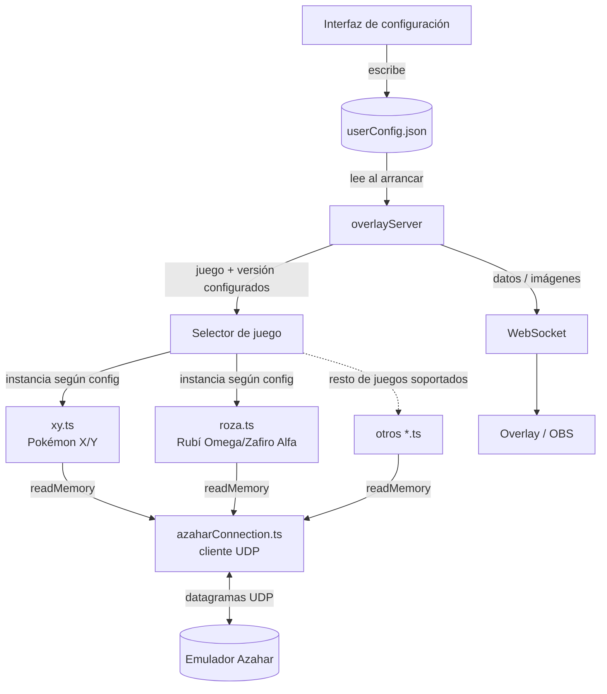

# Roadmap

## Diagrama de componentes (objetivo Fase 1)

Cada juego (`xy.ts`, `roza.ts`, ...) implementa el mismo contrato de "lector de
juego" (medallas, equipo, nombres, vidas...); el selector solo decide cuál
instanciar según lo que diga `userConfig.json`, y todos comparten el mismo
cliente UDP para hablar con el emulador.

## Fase 1 — Overlay funcional para el juego/versión configurados

- **Leer juego y versión desde el archivo de configuración**
  Base de todo lo demás: hoy `overlayServer.ts` importa `xy.ts` a pelo. Hay que
  definir una interfaz común de "lector de juego" (medallas, equipo, nombres,
  vidas...) y un registro que instancie la implementación correcta según el
  juego/versión leídos de `userConfig.json` — leída en el momento de crear el
  reader, no cacheada en una const de módulo al arrancar.

- **Soporte para medallas**
  Ya existe (`procesarMedallas`); migrarlo a la nueva interfaz de lector de
  juego.

- **Soporte para equipo Pokémon**
  Nuevas direcciones de memoria + parsing de la estructura del equipo actual.

- **Soporte para nombres de Pokémon**
  Leer y decodificar los nombres (posible encoding propio del juego, no ASCII
  directo).

- **Contador de vidas**
  Al abrir la app puedes configurar un número de vidas, cada vez que los hp de un pokemon detecten que se fueron a 0, se resta una vida.
  Deberiamos tener 2 recursos a devolver, un contador puro y una serie de iconos de vida que contengan o no color en funcion de las vidas por ejemplo si hay 10 corazones y el usuario perdio 2 vidas, 8 corazones serán de color y 2 en blanco y negro

- **Que el overlay devuelva imágenes en vez de texto**
  Cambiar la respuesta del websocket de un valor suelto a servir
  imágenes/assets (sprites, iconos de medalla, etc.) en vez de datos crudos.

- **Interfaz pequeña para seleccionar la configuración**
  UI mínima que lea/escriba `userConfig.json` (el `save()`/`reload()` de
  `UserConfig` ya está pensado para esto) para elegir juego, versión e IP/puerto
  sin tocar el JSON a mano.

## Fase 2 — Ampliar cobertura dentro de 3DS

- **Soporte para el resto de juegos de 3DS**
  Cada juego/versión nuevo (Rubí Omega/Zafiro Alpha, Sol/Luna...) implica su
  propia tabla de direcciones de memoria, pero reutiliza la interfaz de lector
  de juego definida en la Fase 1.

- **Permitir imágenes personalizadas**
  Que el usuario pueda sustituir los assets por defecto (sprites, fondos...)
  desde su propia carpeta, en vez de los que traiga la app.

## Futuro — Otros emuladores

- **Soporte para otros emuladores (NDS, GBA, Switch...)**
  Cada emulador implica un protocolo de comunicación distinto (Azahar usa UDP
  propio); es la pieza más grande y menos definida por ahora, se aborda cuando
  la Fase 1 y 2 estén cerradas.